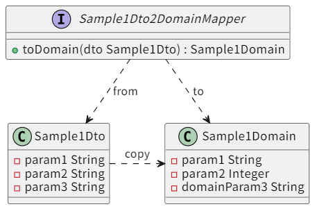
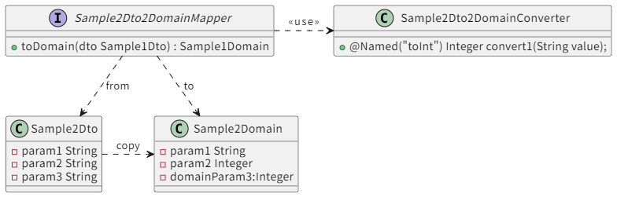
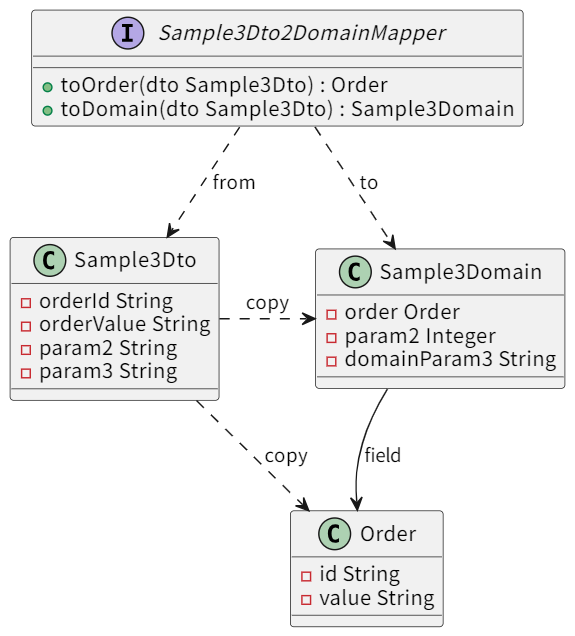
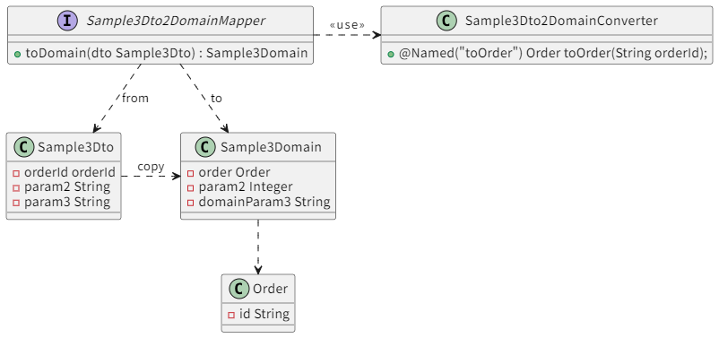
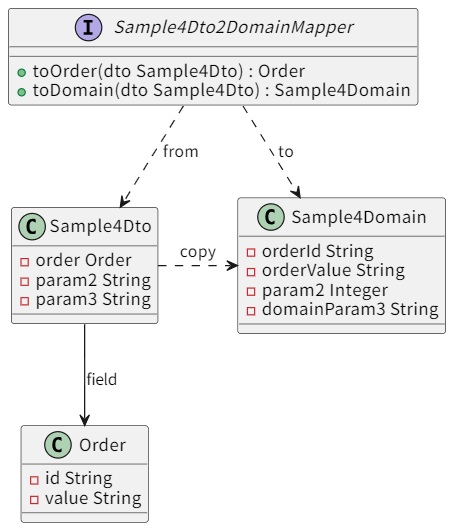
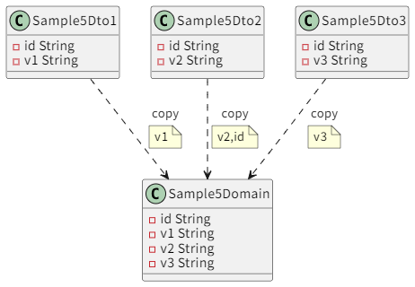
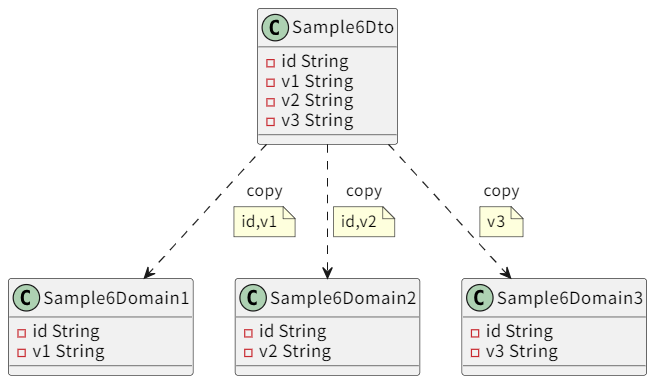
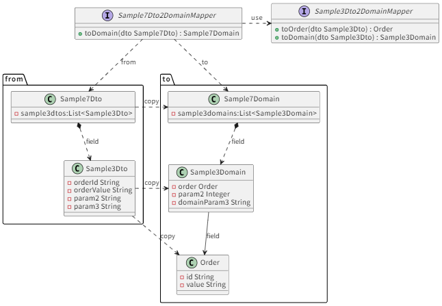
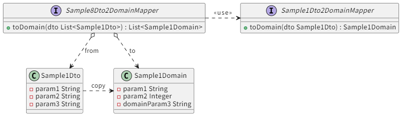

# MapStructSample

MapStruct Sample Project

## サンプル実行方法

Gradle等がインストールされていれば

```
$  ./gradlew clean bootRun
```

で動くと思います。


## Sample1: 通常パタン

- プロパティ名が同じ場合は、自動でマッピングされる。
- 型もいいあんばいに自動で変換してくれる
  - 手動でやるのは後述。qualifiedByName で指定する
- プロパティ名のマッピングを指定することも可能
  - ``unmappedTargetPolicy = ReportingPolicy.WARN` で、マッピングしていないプロパティがあったらコンパイル時に警告がでる



```java
package org.example.sample1.mapper;

import org.mapstruct.Mapper;
import org.mapstruct.Mapping;
import org.mapstruct.ReportingPolicy;
import org.example.sample1.model.Sample1Domain;
import org.example.sample1.model.Sample1Dto;

@Mapper(componentModel = "spring", unmappedTargetPolicy = ReportingPolicy.WARN)
public interface Sample1Dto2DomainMapper {
    @Mapping(source = "param3", target = "domainParam3")
    Sample1Domain toDomain(Sample1Dto source);
}
```

```java
package org.example;

import org.example.sample1.mapper.Sample1Dto2DomainMapper;
import org.example.sample1.model.Sample1Dto;
import org.example.sample2.mapper.Sample2Dto2DomainMapper;
import org.example.sample2.model.Sample2Dto;
import org.springframework.beans.factory.annotation.Autowired;
import org.springframework.boot.CommandLineRunner;
import org.springframework.boot.SpringApplication;
import org.springframework.boot.autoconfigure.SpringBootApplication;
import org.springframework.context.ApplicationContext;

@SpringBootApplication
public class App implements CommandLineRunner {
    @Autowired
    private ApplicationContext context;

    public static void main(String[] args) {
        SpringApplication.run(App.class, args);
    }

    @Override
    public void run(String... args) throws Exception {

        {
            var from = new Sample1Dto("value1", "100", "value3");
            var mapper = context.getBean(Sample1Dto2DomainMapper.class);
            var to = mapper.toDomain(from);
            System.out.println(from);
            System.out.println(to);
        }

    }

}
```

実行結果

```console
Sample1Dto(param1=value1, param2=100, param3=value3)
Sample1Domain(param1=value1, param2=100, domainParam3=value3)
```

## Sample2: 個別の変換ロジックを挟みたい

プロパティごとに、個別の変換ロジックを適用したい場合。

- プロパティの単位で、個別の変換ロジックを適用できる
  - Mapper側で、``uses``と``qualifiedByName``を用いて``param3 → domainParam3``の変換には ``Sample2Dto2DomainConverter``クラスの``toInt`` というメソッドを使うと宣言
  - ``Sample2Dto2DomainConverter``クラス側では ``Named``で先の名前(``toInt``)を指定しておく





Mapper
```java
package org.example.sample2.mapper;

import org.example.Sample2Dto2DomainConverter;
import org.example.sample2.model.Sample2Domain;
import org.example.sample2.model.Sample2Dto;
import org.mapstruct.Mapper;
import org.mapstruct.Mapping;

import org.mapstruct.ReportingPolicy;

@Mapper(componentModel = "spring", unmappedTargetPolicy = ReportingPolicy.WARN, uses = Sample2Dto2DomainConverter.class)
public interface Sample2Dto2DomainMapper {

    @Mapping(source = "param3", target = "domainParam3", qualifiedByName = "toInt")
    Sample2Domain toDomain(Sample2Dto source);

}
```


個別の変換クラスを定義しておく
```java
package org.example;

import org.mapstruct.Named;
import org.springframework.stereotype.Component;

@Component
public class Sample2Dto2DomainConverter {

    @Named("toInt")
    public Integer convert1(String value) {
        System.out.println("Converter#convert1がうごいた");
        // カスタム変換ロジック
        if (value == null || value.trim().isEmpty()) {
            return null;
        }

        String target = value.trim();
        String trim = target.endsWith("歳") ? target.substring(0, target.length() - 1) : target;

        return Integer.parseInt(trim);
    }

}

```


Main
```java
package org.example;

import org.example.sample1.mapper.Sample1Dto2DomainMapper;
import org.example.sample1.model.Sample1Dto;
import org.example.sample2.mapper.Sample2Dto2DomainMapper;
import org.example.sample2.model.Sample2Dto;
import org.springframework.beans.factory.annotation.Autowired;
import org.springframework.boot.CommandLineRunner;
import org.springframework.boot.SpringApplication;
import org.springframework.boot.autoconfigure.SpringBootApplication;
import org.springframework.context.ApplicationContext;

@SpringBootApplication
public class App implements CommandLineRunner {
    @Autowired
    private ApplicationContext context;

    public static void main(String[] args) {
        SpringApplication.run(App.class, args);
    }

    @Override
    public void run(String... args) throws Exception {
        {
            var from = new Sample2Dto("value1", "100", "49歳");
            var mapper = context.getBean(Sample2Dto2DomainMapper.class);
            var to = mapper.toDomain(from);
            System.out.println(from);
            System.out.println(to);
        }
    }

}
```
実行結果

```console
Converter#convert1がうごいた
Sample2Dto(param1=value1, param2=100, param3=49歳)
Sample2Domain(param1=value1, param2=100, domainParam3=49)
```


## Sample3: ネストされたオブジェクトにコピーする1

フラットなオブジェクトを、ネストされた構造にコピーしたい

- フラットなオブジェクト ``Sample3Dto``自体 → ``Order``クラスであるorderプロパティに渡すと考える
  - ``Sample3Dto``自体は ``.`` で表現する
  - 具体的には ``@Mapping(source = ".", target = "order")`` って書けばOK
  - ``Sample3Dto → Order`` のMapperは個別に作成しておくと(``Order toOrder(Sample3Dto source)``) と、自動で呼び出されるので、あとはなにもしなくてよい




Mapper
```java
package org.example.sample3.mapper;

import org.example.sample3.model.Order;
import org.example.sample3.model.Sample3Domain;
import org.example.sample3.model.Sample3Dto;
import org.mapstruct.Mapper;
import org.mapstruct.Mapping;

import org.mapstruct.ReportingPolicy;

@Mapper(componentModel = "spring", unmappedTargetPolicy = ReportingPolicy.WARN)
public interface Sample3Dto2DomainMapper {

    @Mapping(source = "param3", target = "domainParam3")
    @Mapping(source = ".", target = "order")
    Sample3Domain toDomain(Sample3Dto source);

    @Mapping(source = "orderId", target = "id")
    @Mapping(source = "orderValue", target = "value")
    Order toOrder(Sample3Dto source);

}

```

Main

```java
package org.example;

import org.example.sample3.mapper.Sample3Dto2DomainMapper;
import org.example.sample3.model.Sample3Dto;
import org.springframework.beans.factory.annotation.Autowired;
import org.springframework.boot.CommandLineRunner;
import org.springframework.boot.SpringApplication;
import org.springframework.boot.autoconfigure.SpringBootApplication;
import org.springframework.context.ApplicationContext;

@SpringBootApplication
public class App implements CommandLineRunner {
    @Autowired
    private ApplicationContext context;

    public static void main(String[] args) {
        SpringApplication.run(App.class, args);
    }

    @Override
    public void run(String... args) throws Exception {
        {
            var from = new Sample3Dto("0001", "オーダー001", "100", "49歳");
            var mapper = context.getBean(Sample3Dto2DomainMapper.class);
            var to = mapper.toDomain(from);

            System.out.println(from);
            System.out.println(to);
        }
    }

}

```

実行結果

```console
Sample3Dto(orderId=0001, orderValue=オーダー001, param2=100, param3=49歳)
Sample3Domain(order=Order(id=0001, value=オーダー001), param2=100, domainParam3=49歳)
```

## Sample3': ネストされたオブジェクトにコピーする2

ネストしたオブジェクトが、単一のプロパティからのマッピングで生成できるのであれば、既出のカスタマイズメソッド``qualifiedByName``方式でもOK。



```java
変更前
@Mapper(componentModel = "spring", unmappedTargetPolicy = ReportingPolicy.WARN)
public interface Sample3Dto2DomainMapper {

    @Mapping(source = "param3", target = "domainParam3")
    @Mapping(source = ".", target = "order")
    Sample3Domain toDomain(Sample3Dto source);

    @Mapping(source = "orderId", target = "id")
    @Mapping(source = "orderValue", target = "value")
    Order toOrder(Sample3Dto source);

}

変更後
@Mapper(componentModel = "spring", unmappedTargetPolicy = ReportingPolicy.WARN, uses = Sample3Dto2DomainConverter.class)
public interface Sample3Dto2DomainMapper {

    @Mapping(source = "param3", target = "domainParam3")
    @Mapping(source = "orderId", target = "order", qualifiedByName = "toOrder")
    Sample3Domain toDomain(Sample3Dto source);

}
```

```java
@Mapper(componentModel = "spring")
public class Sample3Dto2DomainConverter {
    @Named("toOrder")
    public Order toOrder(String orderId) {
        return new Order(orderId);
    }
}
```

などとして、qualifiedByName でカスタマイズメソッドを挟むでもOK！


## Sample4: ネストされたオブジェクトのフラット化

先と逆で、ネストされたオブジェクトをフラットなオブジェクトにコピーしたい

- ネストされたプロパティへは ``@Mapping(source = "order.id", target = "orderId")`` と指定ができる




Mapper
```java
package org.example.sample4.mapper;

import org.example.sample4.model.Sample4Domain;
import org.example.sample4.model.Sample4Dto;
import org.mapstruct.Mapper;
import org.mapstruct.Mapping;
import org.mapstruct.ReportingPolicy;

@Mapper(componentModel = "spring", unmappedTargetPolicy = ReportingPolicy.WARN)
public interface Sample4Dto2DomainMapper {

    @Mapping(source = "order.id", target = "orderId")
    @Mapping(source = "order.value", target = "orderValue")
    @Mapping(source = "param3", target = "domainParam3")
    Sample4Domain toDomain(Sample4Dto source);

}

```


Main
```java
package org.example;


import org.example.sample4.model.Order;
import org.example.sample4.model.Sample4Dto;
import org.example.sample4.mapper.Sample4Dto2DomainMapper;
import org.springframework.beans.factory.annotation.Autowired;
import org.springframework.boot.CommandLineRunner;
import org.springframework.boot.SpringApplication;
import org.springframework.boot.autoconfigure.SpringBootApplication;
import org.springframework.context.ApplicationContext;

@SpringBootApplication
public class App implements CommandLineRunner {
    @Autowired
    private ApplicationContext context;

    public static void main(String[] args) {
        SpringApplication.run(App.class, args);
    }

    @Override
    public void run(String... args) throws Exception {
        {
            var from = new Sample4Dto(new Order("0001", "オーダー001"), "100", "49歳");
            var mapper = context.getBean(Sample4Dto2DomainMapper.class);
            var to = mapper.toDomain(from);

            System.out.println(from);
            System.out.println(to);

        }
    }

}

```
実行結果

```console
Sample4Dto(order=Order(id=0001, value=オーダー001), param2=100, param3=49歳)
Sample4Domain(orderId=0001, orderValue=オーダー001, param2=100, domainParam3=49歳)
```


## Sample5: 複数のオブジェクトから一つのオブジェクトを作成する

複数のクラス ``Sample5Dto1,Sample5Dto2,Sample5Dto3``から、一つの``Sample5Domain``オブジェクトを作成します。





上記のクラス図のように、プロパティ名が重複していて、``Sample5Dto2``の``id``を使いたいケース、とします。


- インスタンスを渡して、一部だけ更新するメソッドを作成します。
  - ``void toDomain1Update(Sample5Dto1 source,@MappingTarget Sample5Domain target);`` のように、targetのインスタンスを渡すと、指定したプロパティだけを更新します。 
  - ``Sample5Dto1,Sample5Dto2,Sample5Dto3``それぞれの更新メソッドを用いて、複数のオブジェクトから``Sample5Domain``を構築できます。
  - ``@Mapping(target = "id", ignore = true)``などで、targetの更新したくないプロパティ名を指定できます。
  - Fromのクラス達に同名のプロパティがある場合に、どのFromから更新するかを明示的にすることができます。
- また、複数のオブジェクトを引数にとって、それらから一度に更新するメソッドを作成する事もできます。
  - どの引数のオブジェクトかを明確にするために ``@Mapping(source = "s2.id", target = "id")`` のような記法を用います。


Mapper
```java
package org.example.sample5.mapper;

import org.mapstruct.Mapper;
import org.mapstruct.Mapping;
import org.mapstruct.MappingTarget;

import org.mapstruct.ReportingPolicy;
import org.example.sample5.model.Sample5Domain;
import org.example.sample5.model.Sample5Dto1;
import org.example.sample5.model.Sample5Dto2;
import org.example.sample5.model.Sample5Dto3;

@Mapper(componentModel = "spring", unmappedTargetPolicy = ReportingPolicy.WARN)
public interface Sample5Dto2DomainMapper {

    @Mapping(target = "id", ignore = true)
    @Mapping(source = "v1", target = "v1")
    @Mapping(target = "v2", ignore = true)
    @Mapping(target = "v3", ignore = true)
    void toDomain1Update(Sample5Dto1 source,
            @MappingTarget Sample5Domain target);

    @Mapping(source = "id", target = "id")
    @Mapping(target = "v1", ignore = true)
    @Mapping(source = "v2", target = "v2")
    @Mapping(target = "v3", ignore = true)
    void toDomain2Update(Sample5Dto2 source,
            @MappingTarget Sample5Domain target);

    @Mapping(target = "id", ignore = true)
    @Mapping(target = "v1", ignore = true)
    @Mapping(target = "v2", ignore = true)
    @Mapping(source = "v3", target = "v3")
    void toDomain3Update(Sample5Dto3 source,
            @MappingTarget Sample5Domain target);


    @Mapping(source = "s2.id", target = "id")
    void toDomainUpdate(Sample5Dto1 s1, Sample5Dto2 s2, Sample5Dto3 s3,
            @MappingTarget Sample5Domain target);

}

```

Main
```java
package org.example;

import org.example.sample1.mapper.Sample1Dto2DomainMapper;
import org.example.sample1.model.Sample1Dto;
import org.example.sample2.mapper.Sample2Dto2DomainMapper;
import org.example.sample2.model.Sample2Dto;
import org.example.sample3.mapper.Sample3Dto2DomainMapper;
import org.example.sample3.model.Sample3Dto;
import org.example.sample4.mapper.Sample4Dto2DomainMapper;
import org.example.sample4.model.Order;
import org.example.sample4.model.Sample4Dto;
import org.example.sample5.mapper.Sample5Dto2DomainMapper;
import org.example.sample5.model.Sample5Domain;
import org.example.sample5.model.Sample5Dto1;
import org.example.sample5.model.Sample5Dto2;
import org.example.sample5.model.Sample5Dto3;
import org.springframework.beans.factory.annotation.Autowired;
import org.springframework.boot.CommandLineRunner;
import org.springframework.boot.SpringApplication;
import org.springframework.boot.autoconfigure.SpringBootApplication;
import org.springframework.context.ApplicationContext;

@SpringBootApplication
public class App implements CommandLineRunner {
    @Autowired
    private ApplicationContext context;

    public static void main(String[] args) {
        SpringApplication.run(App.class, args);
    }

    @Override
    public void run(String... args) throws Exception {
        {
            var from1 = new Sample5Dto1("id1", "value1");
            var from2 = new Sample5Dto2("id2", "value2");
            var from3 = new Sample5Dto3("id3", "value3");

            var mapper = context.getBean(Sample5Dto2DomainMapper.class);
            Sample5Domain to = null;

            to = new Sample5Domain();
            mapper.toDomain1Update(from1, to);
            System.out.println(to + ": v1だけ、コピーされた");
            mapper.toDomain2Update(from2, to);
            System.out.println(to + ": id,v2だけ、コピーされた");
            mapper.toDomain3Update(from3, to);
            System.out.println(to + ": v3だけ、コピーされた");

            to = new Sample5Domain();
            mapper.toDomainUpdate(from1, from2, from3, to);
            System.out.println(to);
        }
    }

}
```
実行結果

```console
Sample5Domain(id=null, v1=value1, v2=null, v3=null): v1だけ、コピーされた
Sample5Domain(id=id2, v1=value1, v2=value2, v3=null): id,v2だけ、コピーされた
Sample5Domain(id=id2, v1=value1, v2=value2, v3=value3): v3だけ、コピーされた
Sample5Domain(id=id2, v1=value1, v2=value2, v3=value3)
```

注:下記コメントに書きましたが、実際は

```java
    @Mapping(target = "id", ignore = true) 
    @Mapping(source = "v1", target = "v1") // 同名は記述不要
    @Mapping(target = "v2", ignore = true) // sourceにv2がないので実際は記述不要
    @Mapping(target = "v3", ignore = true) // 同上
    void toDomain1Update(Sample5Dto1 source, @MappingTarget Sample5Domain target);
```

なので、明示的にコピーを抑止したい``@Mapping(target = "id", ignore = true)``だけの記述でもOKです。
ただ 、``unmappedTargetPolicy = ReportingPolicy.WARN``  などにしていると、警告が出ます。


## Sample6:一つのオブジェクトから複数のオブジェクトを作成する。

先ほどの逆。複数のオブジェクトのコピーは順次やるだけ。



`Sample6Domain3` の`id`だけ除外してみます。名前が一致しているのは省略するなど、最低限で書いてみると、下記の通りとってもシンプルです。

Mapper

```java
package org.example.sample6.mapper;

import org.example.sample6.model.Sample6Domain1;
import org.example.sample6.model.Sample6Domain2;
import org.example.sample6.model.Sample6Domain3;
import org.example.sample6.model.Sample6Dto;
import org.mapstruct.Mapper;
import org.mapstruct.Mapping;
import org.mapstruct.ReportingPolicy;

@Mapper(componentModel = "spring", unmappedTargetPolicy = ReportingPolicy.WARN)
public interface Sample6Dto2DomainMapper {

    Sample6Domain1 toDomain1(Sample6Dto source);
    Sample6Domain2 toDomain2(Sample6Dto source);

    @Mapping(target = "id", ignore = true)
    Sample6Domain3 toDomain3(Sample6Dto source);

}
```


Main

```java
package org.example;

import org.example.sample6.mapper.Sample6Dto2DomainMapper;
import org.example.sample6.model.Sample6Dto;
import org.springframework.beans.factory.annotation.Autowired;
import org.springframework.boot.CommandLineRunner;
import org.springframework.boot.SpringApplication;
import org.springframework.boot.autoconfigure.SpringBootApplication;
import org.springframework.context.ApplicationContext;

@SpringBootApplication
public class App implements CommandLineRunner {
    @Autowired
    private ApplicationContext context;

    public static void main(String[] args) {
        SpringApplication.run(App.class, args);
    }

    @Override
    public void run(String... args) throws Exception {
        {

            var from = new Sample6Dto("id", "value1", "value2", "value3");
            var mapper = context.getBean(Sample6Dto2DomainMapper.class);
            System.out.println(from);
            System.out.println(mapper.toDomain1(from));
            System.out.println(mapper.toDomain2(from));
            System.out.println(mapper.toDomain3(from)+ ": idコピーはちゃんと除外できた");
        }

    }

}
```

実行結果

```console
Sample6Dto(id=id, v1=value1, v2=value2, v3=value3)
Sample6Domain1(id=id, v1=value1)
Sample6Domain2(id=id, v2=value2)
Sample6Domain3(id=null, v3=value3): idコピーはちゃんと除外できた
```


## Sample7:オブジェクトのプロパティのFrom/Toに List がある場合

- プロパティにListがあったとしても、コピーできる
- コピーロジックを明示的にするために、 uses で、Listの要素のMapperを教えてあげる




Mapper

```java
package org.example.sample7.mapper;

import org.mapstruct.Mapper;
import org.mapstruct.Mapping;
import org.mapstruct.MappingTarget;

import org.mapstruct.ReportingPolicy;
import org.example.sample3.mapper.Sample3Dto2DomainMapper;
import org.example.sample7.model.Sample7Domain;
import org.example.sample7.model.Sample7Dto;

@Mapper(componentModel = "spring", unmappedTargetPolicy = ReportingPolicy.WARN, uses = {
        Sample3Dto2DomainMapper.class, })
public interface Sample7Dto2DomainMapper {

    @Mapping(source = "sample3dtos", target = "sample3domains")
    Sample7Domain toDomain(Sample7Dto source);

    @Mapping(source = "sample3dtos", target = "sample3domains")
    void toDomainUpdate(Sample7Dto source,
            @MappingTarget Sample7Domain target);

}
```


Main

```java
package org.example;

import java.util.List;

import org.example.sample1.mapper.Sample1Dto2DomainMapper;
import org.example.sample1.model.Sample1Dto;
import org.example.sample2.mapper.Sample2Dto2DomainMapper;
import org.example.sample2.model.Sample2Dto;
import org.example.sample3.mapper.Sample3Dto2DomainMapper;
import org.example.sample3.model.Sample3Dto;
import org.example.sample4.mapper.Sample4Dto2DomainMapper;
import org.example.sample4.model.Order;
import org.example.sample4.model.Sample4Dto;
import org.example.sample5.mapper.Sample5Dto2DomainMapper;
import org.example.sample5.model.Sample5Domain;
import org.example.sample5.model.Sample5Dto1;
import org.example.sample5.model.Sample5Dto2;
import org.example.sample5.model.Sample5Dto3;
import org.example.sample6.mapper.Sample6Dto2DomainMapper;
import org.example.sample6.model.Sample6Dto;
import org.example.sample7.mapper.Sample7Dto2DomainMapper;
import org.example.sample7.model.Sample7Dto;
import org.example.sample8.mapper.Sample8Dto2DomainMapper;
import org.springframework.beans.factory.annotation.Autowired;
import org.springframework.boot.CommandLineRunner;
import org.springframework.boot.SpringApplication;
import org.springframework.boot.autoconfigure.SpringBootApplication;
import org.springframework.context.ApplicationContext;

@SpringBootApplication
public class App implements CommandLineRunner {
    @Autowired
    private ApplicationContext context;

    public static void main(String[] args) {
        SpringApplication.run(App.class, args);
    }

    @Override
    public void run(String... args) throws Exception {
        {
            var fromList = List.of(
                    new Sample3Dto("0011", "オーダー011", "101", "11歳"),
                    new Sample3Dto("0021", "オーダー021", "102", "12歳"),
                    new Sample3Dto("0031", "オーダー031", "103", "13歳"));

            var from = new Sample7Dto(fromList);
            var mapper = context.getBean(Sample7Dto2DomainMapper.class);

            System.out.println(from);
            var to = mapper.toDomain(from);
            System.out.println(to);
        }
    }

}
```

実行結果(適度に改行入れました)

```console
Sample7Dto(sample3dtos=
[Sample3Dto(orderId=0011, orderValue=オーダー011, param2=101, param3=11歳), 
 Sample3Dto(orderId=0021, orderValue=オーダー021, param2=102, param3=12歳),
 Sample3Dto(orderId=0031, orderValue=オーダー031, param2=103, param3=13歳)])
Sample7Domain(sample3domains=
[Sample3Domain(order=Order(id=0011, value=オーダー011), param2=101, domainParam3=11歳), 
 Sample3Domain(order=Order(id=0021, value=オーダー021), param2=102, domainParam3=12歳), 
 Sample3Domain(order=Order(id=0031, value=オーダー031), param2=103, domainParam3=13歳)])
```

よさそうですね！


## Sample8:オブジェクトのList自体をコピーしたい場合


- なにかのList に対して、ListへのコピーもOK
- コピーロジックを明示的にするために、 uses で、Listの要素のMapperを教えてあげる





Mapper

```java
package org.example.sample8.mapper;

import org.mapstruct.Mapper;
import org.mapstruct.MappingTarget;

import org.mapstruct.ReportingPolicy;

import java.util.List;

import org.example.sample1.mapper.Sample1Dto2DomainMapper;
import org.example.sample1.model.Sample1Domain;
import org.example.sample1.model.Sample1Dto;

@Mapper(componentModel = "spring", unmappedTargetPolicy = ReportingPolicy.WARN, uses = {
        Sample1Dto2DomainMapper.class, })
public interface Sample8Dto2DomainMapper {

    List<Sample1Domain> toDomain(List<Sample1Dto> source);

    void toDomainUpdate(List<Sample1Dto> source,
            @MappingTarget List<Sample1Domain> target);

}
```


Main

```java

package org.example;

import java.util.List;

import org.example.sample1.mapper.Sample1Dto2DomainMapper;
import org.example.sample1.model.Sample1Dto;
import org.example.sample2.mapper.Sample2Dto2DomainMapper;
import org.example.sample2.model.Sample2Dto;
import org.example.sample3.mapper.Sample3Dto2DomainMapper;
import org.example.sample3.model.Sample3Dto;
import org.example.sample4.mapper.Sample4Dto2DomainMapper;
import org.example.sample4.model.Order;
import org.example.sample4.model.Sample4Dto;
import org.example.sample5.mapper.Sample5Dto2DomainMapper;
import org.example.sample5.model.Sample5Domain;
import org.example.sample5.model.Sample5Dto1;
import org.example.sample5.model.Sample5Dto2;
import org.example.sample5.model.Sample5Dto3;
import org.example.sample6.mapper.Sample6Dto2DomainMapper;
import org.example.sample6.model.Sample6Dto;
import org.example.sample7.mapper.Sample7Dto2DomainMapper;
import org.example.sample7.model.Sample7Dto;
import org.example.sample8.mapper.Sample8Dto2DomainMapper;
import org.springframework.beans.factory.annotation.Autowired;
import org.springframework.boot.CommandLineRunner;
import org.springframework.boot.SpringApplication;
import org.springframework.boot.autoconfigure.SpringBootApplication;
import org.springframework.context.ApplicationContext;

@SpringBootApplication
public class App implements CommandLineRunner {
    @Autowired
    private ApplicationContext context;

    public static void main(String[] args) {
        SpringApplication.run(App.class, args);
    }

    @Override
    public void run(String... args) throws Exception {
        {
            var fromList = List.of(
                    new Sample1Dto("0011", "100", "101"),
                    new Sample1Dto("0021", "101", "102"),
                    new Sample1Dto("0031", "102", "103"));

            var mapper = context.getBean(Sample8Dto2DomainMapper.class);

            var toList = mapper.toDomain(fromList);
            for (int i = 0; i < fromList.size(); i++) {
                System.out.println(fromList.get(i));
                System.out.println(toList.get(i));
            }
        }
    }

}
```

実行結果

```console
Sample1Dto(param1=0011, param2=100, param3=101)
Sample1Domain(param1=0011, param2=100, domainParam3=101)
Sample1Dto(param1=0021, param2=101, param3=102)
Sample1Domain(param1=0021, param2=101, domainParam3=102)
Sample1Dto(param1=0031, param2=102, param3=103)
Sample1Domain(param1=0031, param2=102, domainParam3=103)
```

よさそうですね！